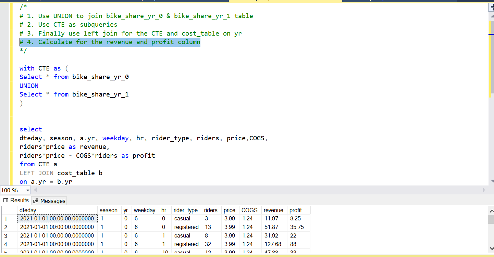
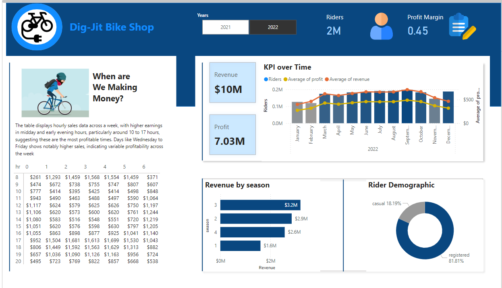
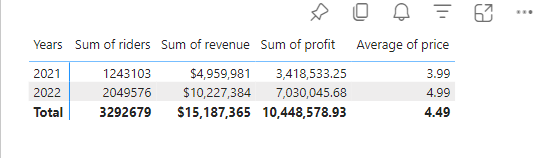

# Dig-Jit bike shop data
#### Data Portfolio: Excel to Power BI 


# Table of contents 

- [Objective](#objective)
- [Data Source](#data-source)
- [Stages](#stages)
- [ETL](#etl)
  - [Pseudocode](#pseudocode)
- [Design](#design)
  - [Dashboard Mockup](#dashboard-mockup)
  - [Tools](#tools)
- [Visualization](#visualization)
  - [Results](#results)
  - [DAX Measures](#dax-measures)
- [Analysis](#analysis)
  - [Findings](#findings)
- [Recommendations](#recommendations) 


# Objective

  Dig- Jit bike shop needs my expertise as a data analyst to develop a dashboard that displays their key performance metrics for informed decision making


### What are the requirements?

To create a dashboard that provides insights into the bike data for both years 2021 and 2022 which includes
  -  Hourly Revenue Analysis
  -  Profit & Revenue Trends
  -  Seasonal Revenue
  -  Rider Demographics

Design and Aesthetics - Use our company colours and ensure the dashboard is easy to navigate

Please provide an estimated timeline for completion and recommendation on raising prices next year


# Data source

Access to our database will be provided. If no database, please create one.


# Stages

  - ETL
  - Design
  - Analysis

# ETL

## Pseudocode

  - What is the general approach in creating this solution from start to finish? 

  1. Get the data
  2. Explore the data in Excel
  3. Build a database
  4. Load the data into the SQL Server
  5. Develop the SQL queries
  6. Connect PowerBi to the database
  7. Generate DAX measures
  8. Build a Dashboard
  9. Make analysis + recommendations
  10. Publish the data to GitHub Pages


### Transform the data


```sql
/*
# 1. Use UNION to join bike_share_yr_0 & bike_share_yr_1 table
# 2. Use CTE as subqueries
# 3. Use left join for the CTE and cost_table on yr
# 4. Calculate the revenue and profit column
*/


with CTE as (
Select * from bike_share_yr_0
UNION
Select * from bike_share_yr_1
)


select 
dteday, season, a.yr, weekday, hr, rider_type, riders, price,COGS,
riders*price as revenue,
riders*price - COGS*riders as profit
from CTE a
LEFT JOIN cost_table b
on a.yr = b.yr
```

#### Output




# Design

## Dashboard components required
  - What should the dashboard contain based on the requirements provided?

  1. Hourly Revenue Analysis
  2. Profit and Revenue Trends
  3. Seasonal Revenue
  4. Rider Demographics


## Dashboard mockup

  - What should it look like?

Some of the data visuals that may be appropriate in answering our questions include:

1. Matrix
2. Line and Column chart
3. Bar chart
4. Donut chart
5. Card(new)


## Tools


| Tool | Purpose |
| --- | --- |
| Excel | Cleaning and exploring the data |
| SQL Server | Joining multiple tables and analyzing the data |
| Power BI | Visualize the data via interactive dashboard |
| Github | Hosting the project documentation and version control |


# Visualization


## Results

  - What does the dashboard look like?




## DAX Measures

### 1. Profit Margin
```sql
Profit Margin = (SUM(Query1[revenue])-SUM(Query1[profit]))/SUM(Query1[profit])
```


# Analysis

## Findings



From the table above it was observed that
1. There was 25% price increase from 2021 to 2022
2. There was 64% increase in demand(riders) from 2021 to 2022
3. Revenue increased by 106% from 2021 to 2022
4. Profit increased by 106% from 2021 to 2022 


# Recommendations


### Conservative Increase:

Considering the substantial increase last year, a more conservative increase might be prudent to avoid hitting a price ceiling where demand starts to drop. An increase in the range of 10-15% could test the market's response without risking a significant loss of customers. 


### Price Setting:
  - If the price in 2022 was $4.99, a 10% increase would make the new price about $5.49. 
  - A 15% increase would set the price at approximately $5.74. 


## Recommended Strategy: 


### Market Analysis: 
Conduct further market research to understand customer satisfaction, potential competitive changes, and the overall economic environment. This can guide whether leaning towards the lower or higher end of the suggested increase 


### Segmented Pricing Strategy: 
Consider different pricing for casual versus registered users, as they may have different price sensitivities. 


### Monitor and Adjust: 
Implement the new prices but be ready to adjust based on immediate customer feedback and sales data. Monitoring closely will allow you to fine-tune your pricing strategy without committing fully to a price that might turn out to be too high.
